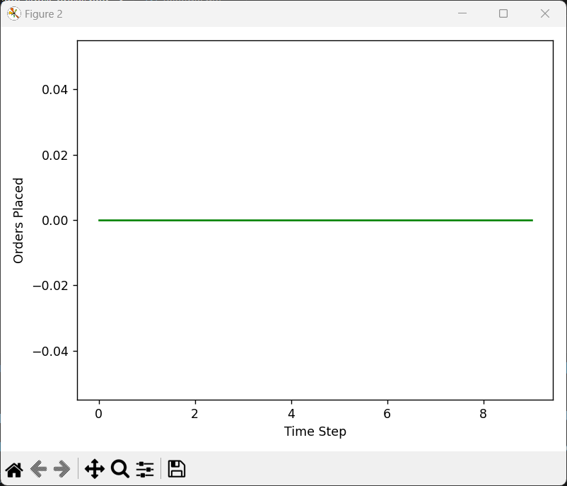

# Trading Agent Simulation Report

This report provides an overview of the Trading Agent Simulation, which manages the stock and pricing of smartphones. The simulation includes importing necessary libraries, defining the TradingAgent class, running the simulation with sample data, and visualizing the results.

## Import Libraries

We need to import the necessary libraries for plotting and numerical operations.

```python
import matplotlib.pyplot as plt
import numpy as np
```
## Define the TradingAgent Class

This class will manage the trading operations, including stock levels, pricing, and order decisions.

```python
class TradingAgent:
    def __init__(self, avg_price, critical_stock=10, discount_threshold=0.2, order_quantity=10):
        # Initializing the agent with given parameters
        self.avg_price = avg_price  # Average price of smartphone
        self.critical_stock = critical_stock  # Critical stock level
        self.discount_threshold = discount_threshold  # Discount threshold (20%)
        self.order_quantity = order_quantity  # Default order quantity if stock is low
        self.stock = 50  # Initial stock
        self.price = avg_price  # Initial price
        self.orders = []  # List to track orders over time
        self.prices = []  # List to track prices over time
        self.stocks = []  # List to track stock levels over time
        self.decision_log = []  # Track decision history for analysis

    def update_avg_price(self, new_price):
        """Update the average price dynamically."""
        self.avg_price = (self.avg_price + new_price) / 2  # Simple moving average

    def decide_order(self):
        # Decision logic based on price and stock level
        if self.price <= self.avg_price * (1 - self.discount_threshold) and self.stock >= self.critical_stock:
            to_buy = max(15, self.stock // 2)  # Order a dynamic quantity (min 15, or half stock)
            self.orders.append(to_buy)
            self.stock += to_buy
            self.update_avg_price(self.price)  # Update average price with the latest price
            self.decision_log.append(('Price Discount', self.price, self.stock, to_buy))
        elif self.stock < self.critical_stock:
            to_buy = self.order_quantity
            self.orders.append(to_buy)
            self.stock += to_buy
            self.decision_log.append(('Critical Stock', self.price, self.stock, to_buy))
        else:
            self.orders.append(0)
            self.decision_log.append(('No Order', self.price, self.stock, 0))

    def update_price(self, new_price):
        """Update the current price."""
        self.price = new_price

    def run_simulation(self, price_changes, stock_changes):
        """Simulate the agent's decision over time."""
        for i in range(len(price_changes)):
            self.update_price(price_changes[i])
            self.stock += stock_changes[i]
            self.decide_order()  # Make decision based on the current price and stock
            # Track the data for plotting
            self.prices.append(self.price)
            self.stocks.append(self.stock)

        # Plot the results after simulation
        self.plot_results()

    def plot_results(self):
        """Plot stock levels and orders over time."""
        fig, ax1 = plt.subplots()

        ax1.set_xlabel('Time Step')
        ax1.set_ylabel('Stock Level', color='tab:blue')
        ax1.plot(self.stocks, color='tab:blue', label="Stock Level")
        ax1.tick_params(axis='y', labelcolor='tab:blue')

        ax2 = ax1.twinx()
        ax2.set_ylabel('Price', color='tab:red')
        ax2.plot(self.prices, color='tab:red', label="Price", linestyle="--")
        ax2.tick_params(axis='y', labelcolor='tab:red')

        fig, ax3 = plt.subplots()
        ax3.set_xlabel('Time Step')
        ax3.set_ylabel('Orders Placed')
        ax3.plot(self.orders, label="Orders Placed", color='green')

        plt.tight_layout()
        plt.show()
```

## Test the TradingAgent Class

We will test the TradingAgent class with some simulated data for price changes and stock changes.

```python
# Test the TradingAgent class with simulated data
if __name__ == "__main__":
    avg_price = 600  # Average price of smartphone
    price_changes = [600, 580, 550, 500, 650, 600, 620, 580, 600, 560]  # Simulated price data
    stock_changes = [0, 0, -5, 0, 0, -2, 0, 0, -3, 0]  # Simulated stock changes

    agent = TradingAgent(avg_price)
    agent.run_simulation(price_changes, stock_changes)
```

## Simulation Results

The following graphs illustrate the results of the simulation:

### Stock Levels and Prices Over Time


### Orders Placed Over Time



## Conclusion

The Trading Agent Simulation successfully demonstrates how the agent manages stock levels and pricing based on the given parameters and simulated data. The graphs provide a clear visualization of the agent's decisions and their impact on stock levels and prices over time.
```
### Sample Images for Graph Screenshots

- `sample_graph_stock_prices.png`
- `sample_graph_orders.png`

These images should be created and saved in the same directory as the markdown file to ensure they are correctly referenced in the report.
```