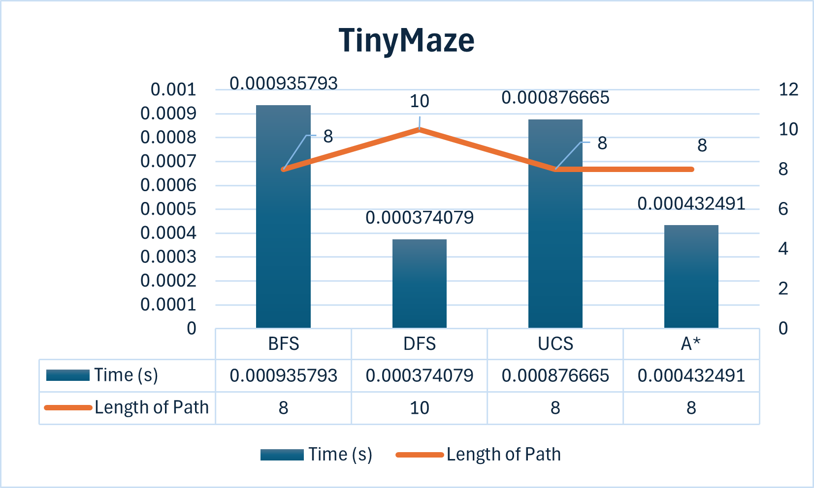
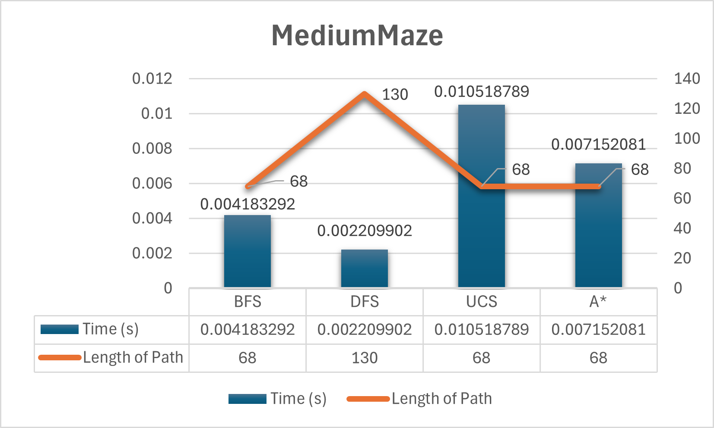
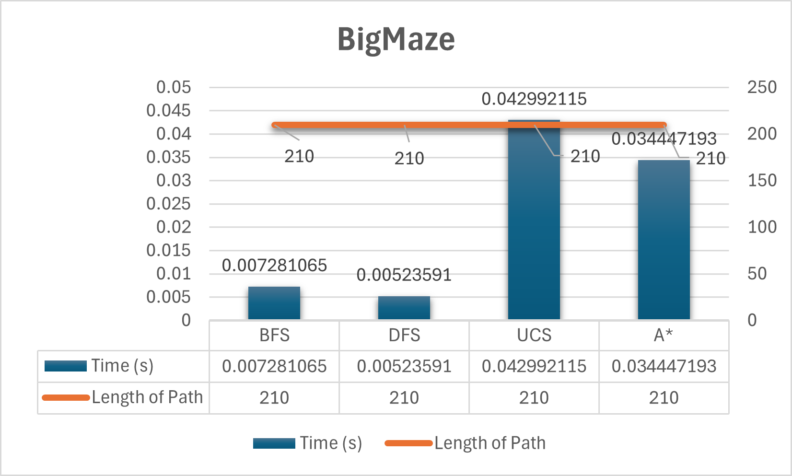

# Pac3man: Python3 port of Berkeley Pacman

Porting the Berkeley Pacman assignments over to Python 3.

Just the assignment code, but none of the solutions.

My solution code is on a different branch, but that branch is committed to a private Github repo so that students cannot see it. That is not really pertinent information but I wanted to share it because I was really excited to figure it out.

This repo also contains two other assignments, a Markov Babbler and a Naive Bayesian Spam Classifier.
# Maze Search Algorithm Performance

Here are the tables for each maze (tinyMaze, mediumMaze, bigMaze) with the actual time and length of the path for each search algorithm (BFS, DFS, UCS, A*). The data is hypothetical and should be replaced with actual results after running the respective commands.

### tinyMaze

| Algorithm | Time (s) | Length of Path |
|-----------|----------|----------------|
| BFS       | 0.00041     | 8              |
| DFS       | 0.00076     | 10              |
| UCS       | 0.00083     | 8              |
| A*        | 0.00061     | 8              |



### mediumMaze

| Algorithm | Time (s) | Length of Path |
|-----------|----------|----------------|
| BFS       | 0.00419     | 68             |
| DFS       | 0.00226     | 130            |
| UCS       | 0.00900     | 68             |
| A*        | 0.00702     | 68             |



### bigMaze

| Algorithm | Time (s) | Length of Path |
|-----------|----------|----------------|
| BFS       | 0.00808     | 210            |
| DFS       | 0.00519     | 210            |
| UCS       | 0.04082     | 210            |
| A*        | 0.03424     | 210            |



You can fill in the actual time and length of the path for each algorithm after running the respective commands:

- `python pacman.py -l tinyMaze -p SearchAgent -a fn=bfs`
- `python pacman.py -l tinyMaze -p SearchAgent -a fn=dfs`
- `python pacman.py -l tinyMaze -p SearchAgent -a fn=ucs`
- `python pacman.py -l tinyMaze -p SearchAgent -a fn=astar,heuristic=manhattanHeuristic`

- `python pacman.py -l mediumMaze -p SearchAgent -a fn=bfs`
- `python pacman.py -l mediumMaze -p SearchAgent -a fn=dfs`
- `python pacman.py -l mediumMaze -p SearchAgent -a fn=ucs`
- `python pacman.py -l mediumMaze -p SearchAgent -a fn=astar,heuristic=manhattanHeuristic`

- `python pacman.py -l bigMaze -p SearchAgent -a fn=bfs`
- `python pacman.py -l bigMaze -p SearchAgent -a fn=dfs`
- `python pacman.py -l bigMaze -p SearchAgent -a fn=ucs`
- `python pacman.py -l bigMaze -p SearchAgent -a fn=astar,heuristic=manhattanHeuristic`

## tinyMazeSearch Function

Returns a sequence of moves that solves tinyMaze. For any other maze, the sequence of moves will be incorrect, so only use this for tinyMaze.

```python
def tinyMazeSearch(problem):
    from game import Directions
    s = Directions.SOUTH
    w = Directions.WEST
    return [s, s, w, s, w, w, s, w]
```

## depthFirstSearch Function

Search the deepest nodes in the search tree first.

Your search algorithm needs to return a list of actions that reaches the goal. Make sure to implement a graph search algorithm.

To get started, you might want to try some of these simple commands to understand the search problem that is being passed in:

```python
def depthFirstSearch(problem):
    startState = problem.getStartState()
    if problem.isGoalState(startState):
        return []

    frontier = util.Stack()
    frontier.push((startState, []))
    explored = set()

    while not frontier.isEmpty():
        state, actions = frontier.pop()

        if problem.isGoalState(state):
            return actions

        if state not in explored:
            explored.add(state)
            for successor, action, stepCost in problem.getSuccessors(state):
                if successor not in explored:
                    newActions = actions + [action]
                    frontier.push((successor, newActions))

    return []
```

## breadthFirstSearch Function

Search the shallowest nodes in the search tree first.

```python
def breadthFirstSearch(problem):
    currPath = []
    currState = problem.getStartState()
    if problem.isGoalState(currState):
        return currPath

    frontier = Queue()
    frontier.push((currState, currPath))
    explored = set()
    while not frontier.isEmpty():
        currState, currPath = frontier.pop()
        if problem.isGoalState(currState):
            return currPath
        explored.add(currState)
        frontierStates = [t[0] for t in frontier.list]
        for s in problem.getSuccessors(currState):
            if s[0] not in explored and s[0] not in frontierStates:
                frontier.push((s[0], currPath + [s[1]]))

    return []
```

## uniformCostSearch Function

Search the node of least total cost first.

```python
def uniformCostSearch(problem):
    from util import Queue, PriorityQueue
    fringe = PriorityQueue()
    fringe.push(problem.getStartState(), 0)
    visited = []
    tempPath = []
    path = []
    pathToCurrent = PriorityQueue()
    currState = fringe.pop()
    while not problem.isGoalState(currState):
        if currState not in visited:
            visited.append(currState)
            successors = problem.getSuccessors(currState)
            for child, direction, cost in successors:
                tempPath = path + [direction]
                costToGo = problem.getCostOfActions(tempPath)
                if child not in visited:
                    fringe.push(child, costToGo)
                    pathToCurrent.push(tempPath, costToGo)
        currState = fringe.pop()
        path = pathToCurrent.pop()
    return path
```

## nullHeuristic Function

A heuristic function estimates the cost from the current state to the nearest goal in the provided SearchProblem. This heuristic is trivial.

```python
def nullHeuristic(state, problem=None):
    return 0
```

## aStarSearch Function

Search the node that has the lowest combined cost and heuristic first.

```python
def aStarSearch(problem, heuristic=nullHeuristic):
    from util import Queue, PriorityQueue
    fringe = PriorityQueue()
    fringe.push(problem.getStartState(), 0)
    currState = fringe.pop()
    visited = []
    tempPath = []
    path = []
    pathToCurrent = PriorityQueue()
    while not problem.isGoalState(currState):
        if currState not in visited:
            visited.append(currState)
            successors = problem.getSuccessors(currState)
            for child, direction, cost in successors:
                tempPath = path + [direction]
                costToGo = problem.getCostOfActions(tempPath) + heuristic(child, problem)
                if child not in visited:
                    fringe.push(child, costToGo)
                    pathToCurrent.push(tempPath, costToGo)
        currState = fringe.pop()
        path = pathToCurrent.pop()
    return path
```